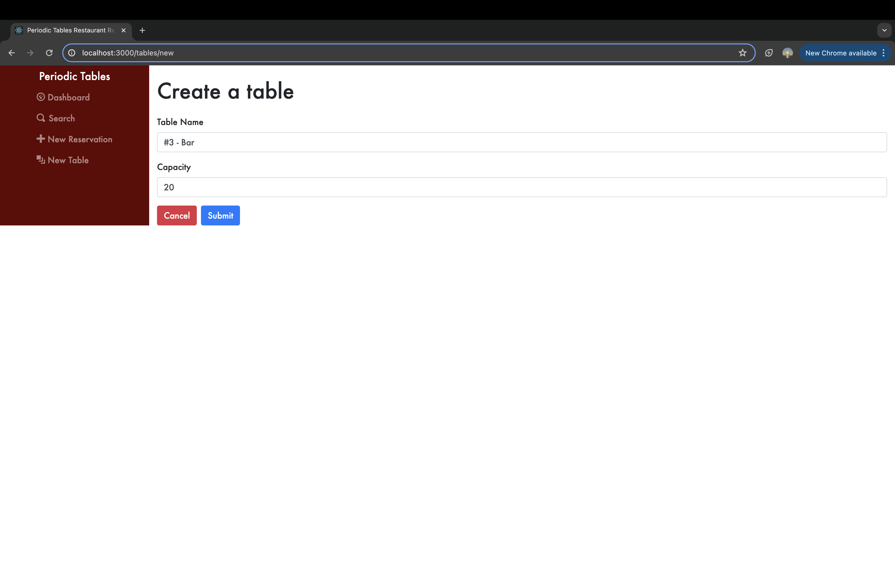

# Periodic Tables (Restaurant Reservation System Capstone Project)

This is my final capstone project for Chegg Skills (formerly known as Thinkful)

## Summary

This is a full-stack app that is used by employees at a restaurant so that they can manage reservations. It is fully responsive and should look clean and nice on mobile, tablet, and desktop. During this project I was tasked at implementing 8 user stories, managing version control with git, making sure that each user story works before moving to the next.
Scenario from project description:

> You have been hired as a full stack developer at _Periodic Tables_, a startup that is creating a reservation system for fine dining restaurants.
> The software is used only by restaurant personnel when a customer calls to request a reservation.
> At this point, the customers will not access the system online.

Deployed Project

## Technology Used
Javascript, React, Node.js, Express.js, Knex.js, PostreSQL (ElephantSQL) CSS, Bootstrap CSS

## Installation

1. Fork and clone this repository.
1. Run `cp ./back-end/.env.sample ./back-end/.env`.
1. Update the `./back-end/.env` file with the connection URL's to your PostgreSQL database instance.
1. Run `cp ./front-end/.env.sample ./front-end/.env`.
1. You should not need to make changes to the `./front-end/.env` file unless you want to connect to a backend at a location other than `http://localhost:5001`.
1. Run `npm install` to install project dependencies.
1. Run `npm run start:dev` to start your server in development mode.

## Features

### Dashboard
Dashboard page renders each reservation and table. Each reservation has an edit, cancel, and seat button if the reservation has not already been seated. There is also status badge next to the reservation name depending on the status of the reservation. Also features Previous, Today, and Next buttons so that the user can easily navigate dates with a click of a button. Defaults to current date.

## Finish a table
Dashboard also displays tables that are occupied with a Finish button, so that the user can free up the table after a reservation has completed. Finishing table prompts the user with a message saying it cannot be undone.

### Create a Reservation
Create a reservation page allows the user to fill out a form with their choice reservation details.
All business rules are enforced when creating this reservation (ex. Reservations cannot be made from 10:30 AM - 9:30 PM, restaurant is closed on tuesdays, can't create a reservation in the past, and all fields must be filled in)

Submit button sends the data to API and creates new reservation
Cancel button returns to previous page

### Create a Table
Create a table page allows the user to fill out a form with their all information required to create a new table.
Each field must be completed to submit form and create the table. Table_Name must be more than one character, and capacity must be a valid number.

### Edit a Reservation
Edit a reservation page allows the user to edit the details of a reservation. The form is autocompleted with the specific reservation the user clicked on, for easy changes. All business rules are enforced as well in Editing the reservation.

### Search Reservations
The search page lets the user search reservations by phone number. User does not need full phone number, they can search for a portion of a phone number and still get the expected reservation results. 
Find button will submit the search and render any reservation with a phone number that match the sequence of numbers searched. Each card will have the same button options as the dashboard.
Cancel button will return the user to the previous page.

## Seat a reservation 
The seating page lets the user choose a table to seat a specific reservation at. It features a drop down menu with a list of options (All tables that are not occupied). Validation will ensure that the party size of reservation does not exceed the table capacity selected before seating the table.

## API Documentation
The backend API for this restaurant reservation system provides several endpoints to manage reservations and tables. For reservations, you can perform operations such as listing all reservations sorted by time (GET /reservations), creating a new reservation (POST /reservations), updating a reservation by ID (PUT /reservations/:reservation_id), and updating its status (PUT /reservations/:reservation_id/status). Additionally, you can retrieve reservations by mobile number (GET /reservations?mobile_number=XXXXXXXXXX) or date (GET /reservations?date=XXXX-XX-XX), both sorted chronologically.

Regarding tables, the API allows you to list all tables (GET /tables), create a new table (POST /tables), assign a table to a reservation (PUT /tables/:table_id/seat), and free a table by removing its assigned reservation (DELETE /tables/:table_id/seat). These endpoints collectively support the functionality needed for managing reservations and table assignments within the restaurant, facilitating efficient operation and organization of dining services.

